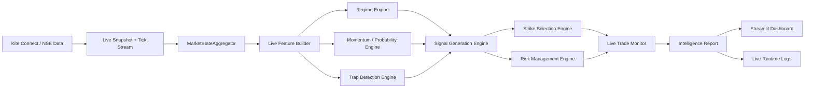

# Trading Engine

Production-grade algorithmic trading framework for Indian markets, focused on NIFTY 50 index intelligence, options analytics, backtesting, and live broker connectivity.

This repository now contains the full live stack: authenticated Kite Connect runtime wiring, NSE option-chain ingestion, rolling market-state aggregation, probabilistic regime-aware signal generation, strike selection, risk planning, live trade monitoring, a Streamlit dashboard, and backtest realism/performance tooling.

## Current Scope

The project is organized around two operating modes that share the same typed model layer and configuration conventions:

1. Research and historical analysis.
2. Live market intelligence and broker-aware execution support.

The live intelligence engine is intentionally conservative. It is designed to answer a narrow operational question on each refresh: given the current NIFTY spot, India VIX, option-chain context, short-horizon price action, and detected regime, is the market actionable, and if so what side, strike, size, and risk plan should be used.

## What Was Added Most Recently

The latest development pass hardened the live intelligence runtime and its documentation footprint. The current implementation includes:

1. A persistent market-state buffer inside the live intelligence engine so regime and transition logic operate on rolling context instead of a one-shot snapshot.
2. Config-driven thresholds for trend strength, compression, volatility, trade quality, signal TTL, state-buffer sizing, partial exits, and time stops.
3. A richer state model with explicit market state, transition, trade grade, volatility state, liquidity state, momentum state, and directional bias.
4. Signal generation that suppresses low-quality states, trap-heavy regimes, sideways compression, and other low-participation environments.
5. A live trade monitor that tracks open, closed, partial, expired, stop-loss, trap, and regime-downgrade outcomes.
6. Dashboard rendering for market state, regime, signal ticket, probabilities, strike selection, open trades, and alert-style lifecycle information.
7. Backtest realism helpers and stratified performance analytics for more realistic execution evaluation.
8. Root runtime settings in `config/settings.py` with environment-variable parsing for live intelligence controls.

## System Architecture



The same report object is also suitable for downstream persistence, monitoring, and future automation because it is built from typed dataclasses rather than ad hoc dictionaries.

## Live Intelligence Stack

The live intelligence stack lives under `src/trading_engine/intelligence/` and is centered on a few core objects:

### `MarketSnapshotBundle`

This is the normalized bundle that carries the current live inputs together:

1. Timestamp.
2. Spot price.
3. India VIX value.
4. Spot frame.
5. VIX frame.
6. Option-chain frame.
7. Tick frame.
8. 1-minute candles.
9. 5-minute candles.

### `MarketStateAggregator`

The aggregator maintains rolling buffers for:

1. Spot data.
2. VIX data.
3. Option-chain rows.
4. Tick data.

It builds derived candles, session context, regime classification inputs, liquidity context, momentum context, trap heuristics, trade grade, signal TTL, and the final `MarketState` object. The latest version keeps this state persistent across refresh cycles so the engine can reason about continuity rather than isolated points.

### `LiveIntelligenceEngine`

The engine coordinates the live pipeline in this order:

1. Build live features from the current snapshot.
2. Update or reuse the persistent market state.
3. Assess traps and fake-breakout risk.
4. Classify regime and transition stage.
5. Produce directional probability estimates.
6. Generate a filtered trading signal.
7. Select the option strike.
8. Produce a risk plan.
9. Update the live trade monitor.
10. Emit an `IntelligenceReport`.

If the live feature frame is empty, the engine returns a neutral report instead of forcing a trade decision.

### `LiveTradeMonitor`

The monitor tracks live trade lifecycle events and updates state for:

1. New trade opens.
2. Partial exits.
3. Stop-loss exits.
4. Time exits.
5. Trap exits.
6. Regime downgrade exits.
7. Signal expiry.
8. Trailing stop updates.

### `SignalGenerationEngine`

The signal layer is conservative by design. It rejects states when:

1. Confidence falls below the configured floor.
2. Trap score exceeds the trap cutoff.
3. Trade grade is `AVOID`.
4. Regime is sideways compression or high-noise.
5. Trade quality is below the configured minimum.

Directional entry is only considered when the probability edge is strong enough and the state is not low-quality.

### `StrikeSelectionEngine`

The strike layer chooses a NIFTY option strike using the current underlying price, the signal direction, and the available option chain. The current design favors a controlled and explainable strike choice over aggressive optimization.

### `RiskManagementEngine`

The risk layer determines whether a trade is allowed and, if so, the quantity, stop, target, and portfolio constraints. It is driven by:

1. Capital.
2. Risk per trade.
3. Max capital exposure.
4. Contract multiplier.
5. Minimum units.
6. Max daily loss.
7. Max trades per day.
8. Partial exit fraction.
9. Time-stop minutes.

## Live Runtime

The continuous runtime is implemented in `src/trading_engine/cli/intelligence.py` and `src/trading_engine/intelligence/runtime.py`.

It does the following:

1. Loads environment-backed settings from `config/settings.py`.
2. Connects to the live data source.
3. Refreshes the current live market snapshot.
4. Normalizes tick frames for the state engine.
5. Builds the intelligence report.
6. Emits callback notifications for each report.
7. Handles streaming if `KITE_STREAM_TOKENS` are configured.
8. Falls back to polling mode when streaming tokens are not present.

The runtime logs are written using `loguru` to both stdout and the configured live log file.

## Dashboard

The dashboard is a Streamlit app located in `src/trading_engine/dashboard/app.py` and launched through `te-dashboard` or `src/trading_engine/cli/dashboard.py`.

It currently renders:

1. Market state summary.
2. Regime and transition information.
3. Volatility context.
4. Session state.
5. Trade grade and quality score.
6. Probability panels.
7. Option-chain snapshot summary.
8. Signal ticket and TTL information.
9. Open trade monitor state.
10. Alert-like notes for lifecycle changes.

## Backtesting and Analytics

The backtesting layer is not a toy wrapper. It now includes more realistic execution assumptions and segmented analytics.

### Execution realism

`src/trading_engine/backtest/realism.py` adds assumptions for:

1. Slippage.
2. Bid/ask spread effects.
3. Liquidity penalty.
4. Delay bars.
5. Partial fills.
6. Realistic fill estimation.

### Performance analytics

`src/trading_engine/backtest/analytics.py` provides stratified reporting by:

1. Regime.
2. Session.
3. Volatility.
4. Weekday.
5. Expiry proximity.
6. Confidence band.
7. Trade grade.

### Backtest harness

The benchmark harness under `src/trading_engine/bench/eval_harness.py` can generate backtest-ready aligned data, run the directional backtest when dependencies are available, and persist metrics artifacts.

## Configuration

There are two configuration surfaces in the repo:

1. Root runtime settings in `config/settings.py` for the live NSE/Kite runtime.
2. YAML-backed research configuration in `src/trading_engine/config/` for the analysis stack.

### Root runtime settings

`config/settings.py` groups settings into:

1. `APISettings` for NSE HTTP endpoints and headers.
2. `StorageSettings` for raw, processed, and metadata directories.
3. `SchedulerSettings` for refresh cadence and symbol selection.
4. `LoggingSettings` for log sinks and retention.
5. `KiteSettings` for auth, reconnect behavior, and streaming tokens.
6. `IntelligenceSettings` for live signal and state thresholds.
7. `RiskSettings` for capital and exposure controls.

Key intelligence environment variables currently supported include:

1. `TE_STATE_BUFFER_ROWS`
2. `TE_BULLISH_PROB_THRESHOLD`
3. `TE_BEARISH_PROB_THRESHOLD`
4. `TE_TRAP_PROB_THRESHOLD`
5. `TE_CONFIDENCE_FLOOR`
6. `TE_TREND_STRENGTH_THRESHOLD`
7. `TE_COMPRESSION_THRESHOLD`
8. `TE_VOLATILITY_HIGH_THRESHOLD`
9. `TE_TRADE_QUALITY_THRESHOLD`
10. `TE_BREAKOUT_LOOKBACK_BARS`
11. `TE_STRUCTURE_LOOKBACK_BARS`
12. `TE_MAX_TRADES_PER_DAY`
13. `TE_MAX_DAILY_LOSS_PCT`
14. `TE_DASHBOARD_REFRESH_SECONDS`
15. `TE_DEFAULT_EXPIRY_DAYS`
16. `TE_PARTIAL_EXIT_FRACTION`
17. `TE_TIME_STOP_MINUTES`
18. `TE_SIGNAL_TTL_MIN_CANDLES`
19. `TE_SIGNAL_TTL_MAX_CANDLES`

Broker/runtime variables include:

1. `KITE_API_KEY`
2. `KITE_API_SECRET`
3. `KITE_ACCESS_TOKEN`
4. `KITE_REQUEST_TOKEN`
5. `KITE_TOKEN_STORE_PATH`
6. `KITE_RECONNECT`
7. `KITE_RECONNECT_MAX_TRIES`
8. `KITE_RECONNECT_MAX_DELAY`
9. `KITE_CONNECT_TIMEOUT`
10. `KITE_STREAM_TOKENS`
11. `KITE_STREAM_MODE`

### YAML research configuration

The research config loader in `src/trading_engine/config/settings.py` reads `configs/base.yaml` and validates it through Pydantic models. That layer still primarily covers ingestion, storage, logging, and environment scaffolding for the research pipeline.

## Installation

```bash
python -m venv .venv
source .venv/bin/activate
pip install -e ".[dev]"
cp .env.example .env
```

After that, fill in `.env` with your local values for Kite Connect, data paths, and intelligence tuning.

## How To Run

1. Activate the environment:

```bash
source .venv/bin/activate
```

2. Start the institutional dashboard:

```bash
te-dashboard
```

3. Start the live intelligence runtime:

```bash
te-intelligence
```

4. If you only want the authenticated Kite runtime:

```bash
te-kite-live
```

5. For a quick validation check before running live, compile the project:

```bash
PYTHONPATH=src:. .venv/bin/python -m compileall -q src broker config main.py
```

The dashboard is the best place to monitor the terminal-style market state view, signal ticket, alerts, open trade monitor, and option-chain intelligence. The live runtime is what refreshes the engine continuously.

## Commands

The package exports these entrypoints:

```bash
te-ingest
te-train
te-infer
te-eval
te-nse-ingest
te-kite-live
te-dashboard
te-intelligence
```

### `te-intelligence`

Starts the continuous live intelligence loop. It polls or streams data, refreshes the market state, generates reports, logs each update, and keeps the trade monitor in sync.

### `te-dashboard`

Starts the Streamlit dashboard that visualizes the current live intelligence state.

### `te-kite-live`

Starts the authenticated Kite Connect runtime and websocket stream handler.

### Other command-line tools

1. `te-ingest` runs historical ingestion.
2. `te-train` runs model training.
3. `te-infer` runs inference.
4. `te-eval` runs the benchmark harness.
5. `te-nse-ingest` routes through the current NSE ingestion runtime.

## Live Flow

The live execution path is currently:

1. Authenticate with Kite Connect.
2. Load environment-backed runtime settings.
3. Fetch a live snapshot for NIFTY spot, India VIX, and the option chain.
4. Refresh the rolling tick and candle buffers.
5. Derive live features from the snapshot and short-horizon windows.
6. Build or update the market state.
7. Classify trend, volatility, session, liquidity, momentum, regime, and transition stage.
8. Score directional probabilities.
9. Detect traps, fake breakouts, stoploss hunts, and liquidity grabs.
10. Filter low-quality or sideways states.
11. Select the strike.
12. Build the risk plan.
13. Update live trade lifecycle state.
14. Emit the report to the dashboard and runtime logs.

## Project Layout

```text
config/                  root runtime settings for live NSE/Kite execution
configs/                 YAML research configuration
main.py                  live broker/NSE entrypoint
broker/                  Kite auth, client, websocket, and normalization helpers
src/trading_engine/
  backtest/              execution realism, metrics, and stratified analytics
  bench/                 benchmark and evaluation harnesses
  cli/                   command-line entrypoints
  common/                shared logging and infrastructure helpers
  config/                YAML-backed research config models and loaders
  dashboard/             Streamlit app for live intelligence
  data/                  historical ingest and cleanup utilities
  features/              research feature engineering
  intelligence/          live market state, signals, strike, risk, monitor, runtime
  ml/                    walk-forward model training and inference
tests/                   unit and integration tests
```

## Operational Notes

1. Live NSE endpoints are sensitive to headers, cookies, and warm-up behavior.
2. Kite access tokens should remain local and should not be committed.
3. The intelligence engine defaults to a conservative no-trade stance when the market state is empty or low-quality.
4. The live runtime and the research stack are intentionally separate but share common typed models and reporting conventions.
5. The backtest helpers are meant to reduce optimism bias by modeling execution cost and fill realism.

## Validation

The repository currently compiles cleanly with:

```bash
PYTHONPATH=src:. .venv/bin/python -m compileall -q src broker config main.py
```

The live intelligence engine has also been smoke-tested on an empty snapshot and returns a neutral report instead of crashing, which is the expected behavior for sparse input.

## Development Status

The project is actively evolving toward a production-grade intraday NIFTY intelligence engine. The current implementation already includes live broker integration, live market-state aggregation, regime-aware scoring, trap suppression, strike selection, risk control, dashboard rendering, and backtest realism. The remaining work is mostly around test depth, research config alignment, and incremental hardening.
